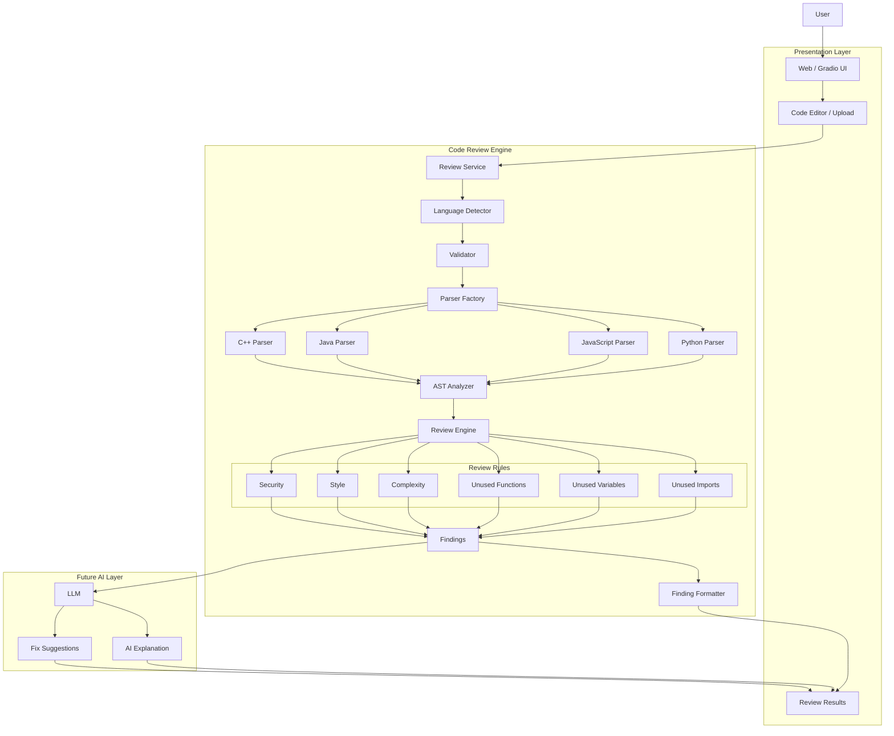

# Code Review Assistant

## 🏗️ System Architecture

An intelligent code review assistant that analyzes source code, detects common issues, and provides structured, actionable findings.

```mermaid
flowchart TB

    USER[User]

    subgraph UI[Presentation Layer]
        WEB[Web / Gradio UI]
        CODE[Code Editor / Upload]
        RESULTS[Review Results]
    end

    subgraph CORE[Code Review Engine]

        API[Review Service]

        DETECTOR[Language Detector]
        VALIDATOR[Validator]

        PARSER_FACTORY[Parser Factory]

        PYTHON_PARSER[Python Parser]
        JS_PARSER[JavaScript Parser]
        JAVA_PARSER[Java Parser]
        CPP_PARSER[C++ Parser]

        AST_ANALYZER[AST Analyzer]

        REVIEW_ENGINE[Review Engine]

        subgraph RULES[Review Rules]
            IMPORT_RULE[Unused Imports]
            VARIABLE_RULE[Unused Variables]
            FUNCTION_RULE[Unused Functions]
            COMPLEXITY_RULE[Complexity]
            STYLE_RULE[Style]
            SECURITY_RULE[Security]
        end

        FINDINGS[Findings]
        FORMATTER[Finding Formatter]
    end

    subgraph FUTURE[Future AI Layer]
        LLM[LLM]
        EXPLAINER[AI Explanation]
        SUGGESTIONS[Fix Suggestions]
    end

    USER --> WEB
    WEB --> CODE
    CODE --> API

    API --> DETECTOR
    DETECTOR --> VALIDATOR
    VALIDATOR --> PARSER_FACTORY

    PARSER_FACTORY --> PYTHON_PARSER
    PARSER_FACTORY --> JS_PARSER
    PARSER_FACTORY --> JAVA_PARSER
    PARSER_FACTORY --> CPP_PARSER

    PYTHON_PARSER --> AST_ANALYZER
    JS_PARSER --> AST_ANALYZER
    JAVA_PARSER --> AST_ANALYZER
    CPP_PARSER --> AST_ANALYZER

    AST_ANALYZER --> REVIEW_ENGINE

    REVIEW_ENGINE --> IMPORT_RULE
    REVIEW_ENGINE --> VARIABLE_RULE
    REVIEW_ENGINE --> FUNCTION_RULE
    REVIEW_ENGINE --> COMPLEXITY_RULE
    REVIEW_ENGINE --> STYLE_RULE
    REVIEW_ENGINE --> SECURITY_RULE

    IMPORT_RULE --> FINDINGS
    VARIABLE_RULE --> FINDINGS
    FUNCTION_RULE --> FINDINGS
    COMPLEXITY_RULE --> FINDINGS
    STYLE_RULE --> FINDINGS
    SECURITY_RULE --> FINDINGS

    FINDINGS --> FORMATTER
    FORMATTER --> RESULTS

    FINDINGS --> LLM
    LLM --> EXPLAINER
    LLM --> SUGGESTIONS

    EXPLAINER --> RESULTS
    SUGGESTIONS --> RESULTS
```
    